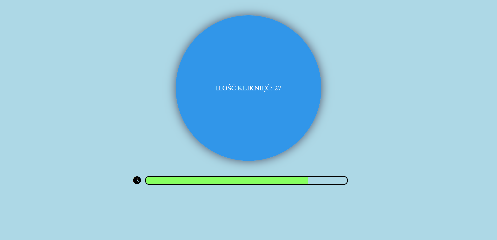
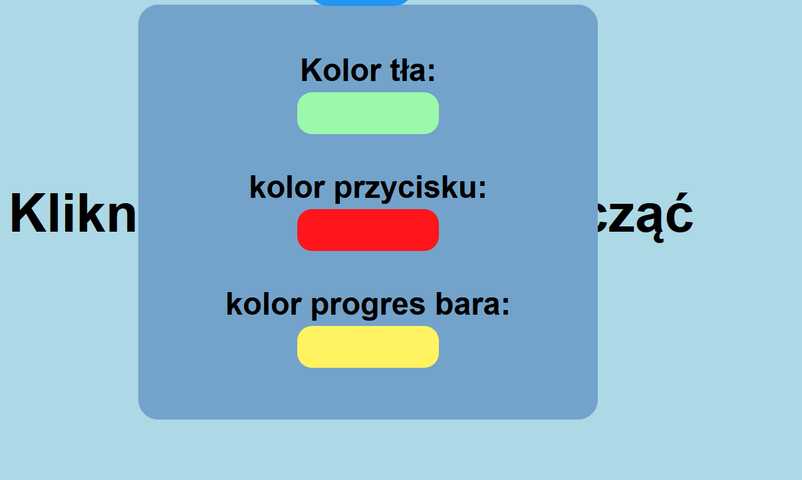
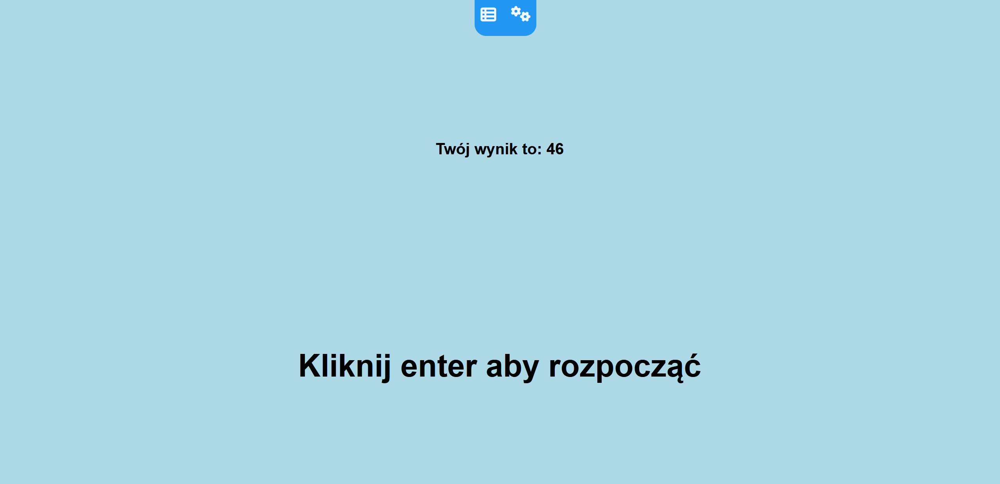
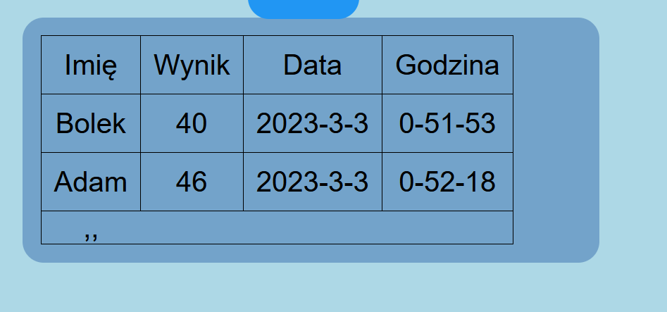

# Gra kliker

### Języki: HTML, Css, JavaScript

## Gra kliker polega na wyklikaniu jak najwięlszej liczby. Na stronie działa dodawanie imion do wyników,zmiana koloru: tła, przycisku oraz progres bara. 

